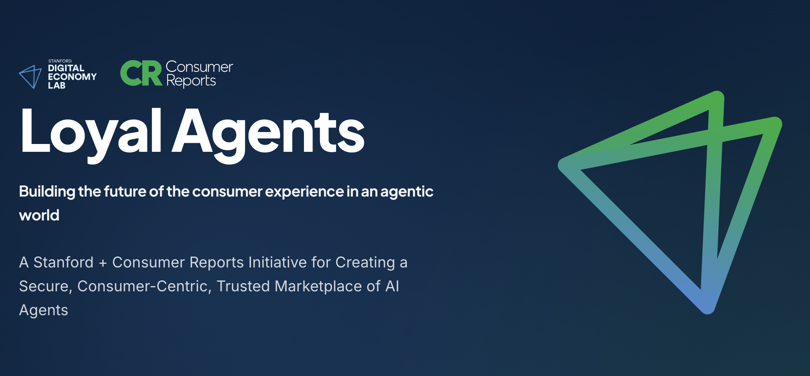

# Loyal Agents

This is the official repo for the Loyal Agents Initiative, a collaborative research project between Stanford's Digital Economy Lab and Consumer Reports Innovation Lab. The site is designed with simplicity and performance in mind, featuring modern CSS animations and responsive design.

## About the Initiative

The Loyal Agents Initiative is focused on creating a secure, consumer-centric, trusted marketplace of AI agents. We're building the future of the consumer experience in an agentic world through research, development, and stakeholder collaboration.

## Contact

For technical questions about the website, please contact:
- **Technical Lead**: [Tobin South](https://tobin.page)
- **General Inquiries**: aiforconsumers@stanford.edu

---

© 2024 Stanford Digital Economy Lab & Consumer Reports Innovation Lab
